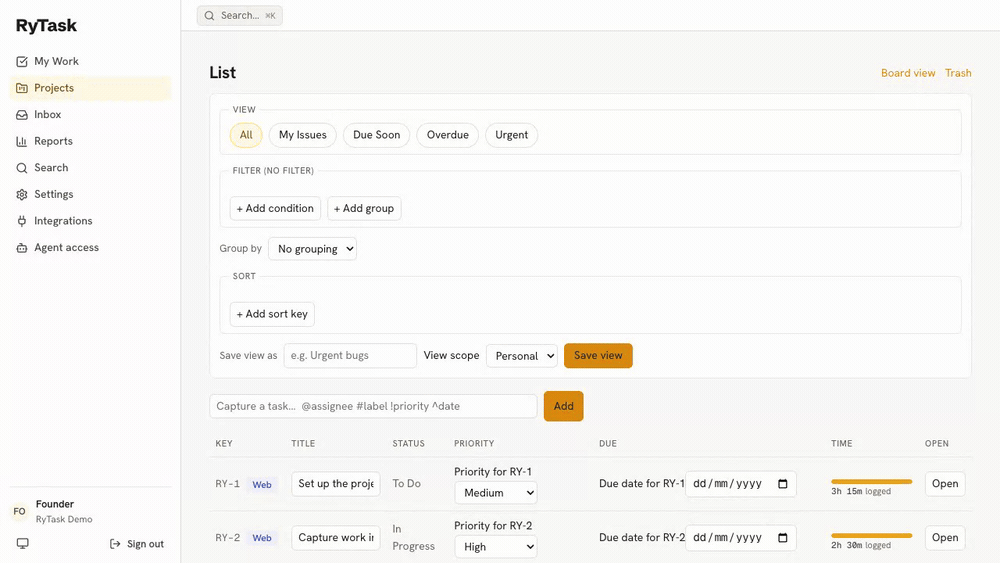
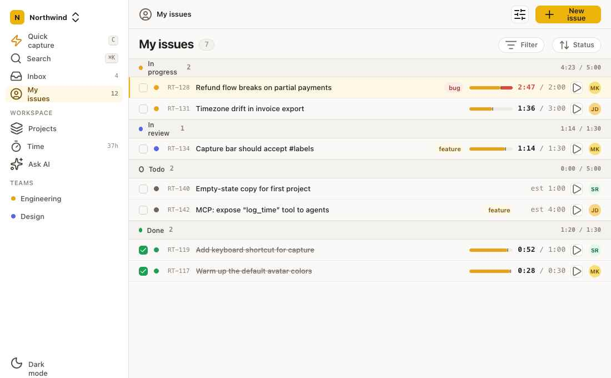
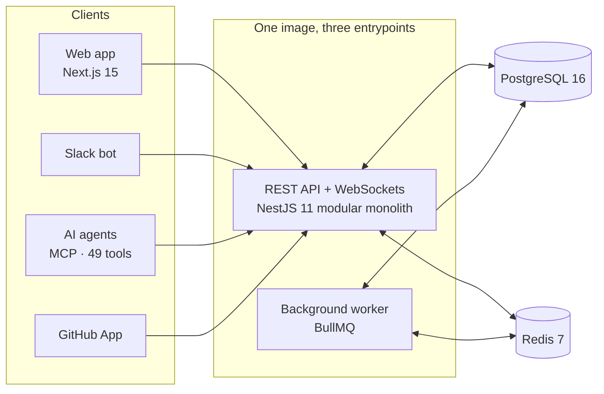

<div align="center">


# RyTask

### Capture work in seconds. Prove where the time went.

**An open-source, self-hostable project tracker for small, interrupt-driven teams —
with native time tracking, first-class Slack capture, and full AI-agent control via MCP.**

[**Documentation**](https://docs.rytask.app) · [**Quickstart**](https://docs.rytask.app/docs/tutorials/quickstart) · [**Self-hosting**](https://docs.rytask.app/docs/guides/self-hosting) · [**MCP tools**](https://docs.rytask.app/docs/reference/mcp-tools) · [**Contributing**](CONTRIBUTING.md)

[](https://github.com/ali-maher-m/RyTask/actions/workflows/ci.yml)
[](LICENSE)
[](https://docs.rytask.app)
[](https://docs.rytask.app/docs/explanation/mcp-parity)
[](package.json)
[](CONTRIBUTING.md)



<sub>Capture the Slack way → start the timer → the meter turns red when you're over budget → it rolls up into a weekly report.</sub>



<sub>The signature move: a plan-vs-actual time meter lives <em>inside</em> every task row.
Logged time fills against the estimate — and turns red when you're over.</sub>

</div>

---

> ⭐ If RyTask is useful to you, please star the repo — it helps a lot.

## Why RyTask

Every team tool gets the same things wrong for small, interrupt-driven teams:

- The features you actually need — **Slack capture** and **time tracking** — are paywalled in the free tiers.
- The good tools are **closed, capped, or cloud-only**. You can't own your data.
- The self-hostable ones are **heavy and jargon-heavy** — non-technical teammates won't touch them.
- None of them give an **AI agent full control** of the workspace.

RyTask is built for the empty quadrant: **deep enough for engineers, friendly enough for
everyone, self-hosted, time-tracked, and AI-native.** The whole core is free and open source —
no feature gates, ever.

[Read the full story →](https://docs.rytask.app/docs/explanation/why-rytask)

## What makes it different

### ⏱ Honest time tracking, built in — not bolted on

A one-click timer in every task row, manual entries when you forget, and every entry classified
as **planned work or an interruption**. The plan-vs-actual report rolls it up per project and per
person, with a full ledger, a "My week" view, and CSV export — so at the end of the week you can
*prove* where the time went, not guess.
[How the time model works →](https://docs.rytask.app/docs/explanation/time-tracking-model)

### 💬 Slack capture in under five seconds

```
/task Fix the login bug @sam ~2h #bug
```

That's a tracked, assigned, estimated, labelled task — without leaving the conversation. Message
actions turn any Slack thread into a task too. Free, not paywalled.
[Slack setup guide →](https://docs.rytask.app/docs/guides/slack)

### 🤖 An MCP server with 100% workspace control

Anything a person can do in the UI, an AI agent can do over MCP — **49 tools**, enforced by an
automated parity gate in CI, served over streamable HTTP and stdio. Create projects, triage
issues, log time, run reports: your agent is a first-class teammate.
[Connect an agent →](https://docs.rytask.app/docs/guides/mcp) ·
[Tool reference →](https://docs.rytask.app/docs/reference/mcp-tools) ·
[Why parity is enforced →](https://docs.rytask.app/docs/explanation/mcp-parity)

### And the rest of a serious tracker

| | |
|---|---|
| **Fast capture everywhere** | One-line quick add with `@assignee` `#label` `!priority` `^friday` — [full grammar](https://docs.rytask.app/docs/reference/capture-syntax) |
| **The core work loop** | Projects, custom statuses, priorities, labels, sub-tasks, comments with mentions, saved views, full-text search, notification inbox |
| **GitHub linking** | Branches, PRs, and commits link to tasks; magic words (`fixes RY-12`) auto-close on merge — free from day one |
| **Real multi-tenancy** | Organizations and workspaces, isolated by construction and verified by automated cross-tenant tests |
| **Data portability** | Full workspace export to JSON — every entity. Your data is yours |
| **Non-technical-friendly** | Plain language, sane defaults, zero jargon. Depth is available, never imposed |

## Quick start

All you need is Docker. Three commands to a running stack:

```bash
git clone https://github.com/ali-maher-m/RyTask.git
cd RyTask

# The API refuses to boot without a strong JWT secret — generate one into a local override:
JWT_SECRET=$(openssl rand -hex 32) && cat > docker-compose.override.yml <<EOF
services:
  api:
    environment:
      JWT_SECRET: "$JWT_SECRET"
  worker:
    environment:
      JWT_SECRET: "$JWT_SECRET"
  web:
    build:
      args:
        NEXT_PUBLIC_API_URL: http://localhost:3001
EOF

docker compose up -d --build
```

Then open [http://localhost:3000](http://localhost:3000) and sign in to the seeded demo
workspace:

- **Email:** `founder@rytask.local`
- **Password:** `rytask-dev-password`

You land in a lived-in demo project — tasks under and over estimate, a timer already running —
so you can see the plan-vs-actual meter doing its job immediately.

The stack is the whole product: web app (`:3000`), API + MCP server (`:3001`), background
worker, PostgreSQL 16, Redis 7, MinIO, and Mailhog, migrated and seeded automatically.

- 📘 **Guided version:** the [15-minute quickstart](https://docs.rytask.app/docs/tutorials/quickstart) walks you from zero to your first tracked task.
- 🚀 **Real server:** the [self-hosting guide](https://docs.rytask.app/docs/guides/self-hosting) and the production stack ([`docker-compose.production.yml`](docker-compose.production.yml), [Dokploy guide](infra/docker/DEPLOY-DOKPLOY.md)) cover TLS, domains, env, and backups.
- ⚙️ **Every setting:** the [environment variable reference](https://docs.rytask.app/docs/reference/environment-variables).

## Connect an AI agent

The MCP server ships in the same image as the API — nothing extra to run.

1. In RyTask, go to **Settings → Agent access** and create a personal access token.
2. Point any MCP client at the streamable HTTP endpoint with the PAT as a bearer token —
   or use the stdio entrypoint for desktop clients.

```jsonc
// Example: Claude Code / any MCP client (HTTP transport)
{
  "mcpServers": {
    "rytask": {
      "url": "http://localhost:3001/api/v1/mcp",
      "headers": { "Authorization": "Bearer <your-PAT>" }
    }
  }
}
```

The agent gets the same powers you have — scoped by the token, governed by the same permissions,
covered by the same audit trail. The docs site also serves
[`llms.txt`](https://docs.rytask.app/llms.txt) so agents can read the manual themselves.

## Documentation

Everything lives at **[docs.rytask.app](https://docs.rytask.app)**, organized in four sections
(the [Diátaxis](https://diataxis.fr) model):

| Section | Start here |
|---|---|
| **Tutorials** — learning by doing | [Quickstart](https://docs.rytask.app/docs/tutorials/quickstart) · [Your first week](https://docs.rytask.app/docs/tutorials/first-week) |
| **How-to guides** — getting a job done | [Self-hosting](https://docs.rytask.app/docs/guides/self-hosting) · [Slack](https://docs.rytask.app/docs/guides/slack) · [MCP](https://docs.rytask.app/docs/guides/mcp) · [Integrations](https://docs.rytask.app/docs/guides/integrations) |
| **Reference** — looking things up | [REST API](https://docs.rytask.app/docs/reference/rest-api) · [MCP tools](https://docs.rytask.app/docs/reference/mcp-tools) · [Capture syntax](https://docs.rytask.app/docs/reference/capture-syntax) · [Environment variables](https://docs.rytask.app/docs/reference/environment-variables) |
| **Explanation** — understanding the design | [Architecture](https://docs.rytask.app/docs/explanation/architecture) · [Multi-tenancy](https://docs.rytask.app/docs/explanation/multi-tenancy) · [The time model](https://docs.rytask.app/docs/explanation/time-tracking-model) |

The docs are honest about status: every feature page carries an **available / in-progress /
coming-soon** badge, and the [feature status matrix](https://docs.rytask.app/docs/reference/feature-status)
shows the complete picture.

## Architecture at a glance

API-first and event-driven: the web app, the Slack bot, the MCP server, and the GitHub
integration are all clients of the **same** REST API and event bus — no special-cased back doors.



The invariants that keep it honest (all enforced by CI, not convention):

- **Hard module boundaries** — each domain module exposes one contract interface and its events;
  importing another module's internals fails the `check:boundaries` gate.
- **Multi-tenant by construction** — every tenant-scoped query is automatically constrained to
  the caller's organization at the repository layer; isolation is asserted by automated tests.
- **MCP parity is a build gate** — `check:mcp-parity` fails CI if any capability lacks a tool
  (or any tool lacks a capability). Currently 49/49.
- **Closed testing** — CI refuses to merge if a *declared required test is missing*, not merely
  failing. Integration tests run against real PostgreSQL, never mocks.

[Deep dive into the architecture →](https://docs.rytask.app/docs/explanation/architecture)

### Repository layout

```
apps/api/        NestJS — API, background worker, and MCP stdio from one image
apps/web/        Next.js web app
apps/docs/       The documentation site (docs.rytask.app)
packages/db/     Drizzle schema — the single source of truth for the data model
packages/contracts/  Shared DTOs + the MCP tool registry
packages/ui/     Shared React components + design tokens
packages/sdk/    Generated TypeScript client
infra/           Dockerfiles, production compose, deployment guides, k6 load tests
branding/        Logos, colors, type — the visual source of truth
knowledge/       The original planning documents (vision, requirements, architecture)
```

**Stack:** NestJS 11 · Next.js 15 / React 19 · Drizzle ORM · PostgreSQL 16 · Redis 7 + BullMQ ·
WebSockets · `@modelcontextprotocol/sdk` · pnpm 9 + Turborepo · Biome · Vitest + testcontainers ·
Playwright + axe.

## Development

```bash
corepack enable          # Node ≥22, pnpm 9
pnpm install
docker compose up -d postgres redis minio mailhog   # just the infrastructure
pnpm db:migrate && pnpm db:seed
pnpm dev                 # web :3000 + api :3001, hot reload
```

Run the same gates CI runs before you open a PR:

```bash
pnpm lint && pnpm typecheck && pnpm test
pnpm check:required-tests && pnpm check:mcp-parity && pnpm check:boundaries && pnpm check:design-tokens
```

The full guide — module anatomy, the testing policy, brand rules, PR flow — is in
[CONTRIBUTING.md](CONTRIBUTING.md).

## Status & roadmap

**Stage 1 (internal MVP) is complete and on `main`:** identity & tenancy, the core work loop,
Slack capture, the 49-tool MCP server, the flagship time tracking + plan-vs-actual reporting,
GitHub linking, and full workspace export — all behind the CI gates described above.

**Stage 2 (public OSS beta) is what comes next:** hardened self-hosting for strangers, Gantt +
calendar views, two-way Slack sync, cycles/milestones/dependencies/custom fields, and a real
community on-ramp. Stage 3 grows it into a platform — plugins, importers (Jira/Linear/Plane),
advanced analytics, optional managed cloud.

[The roadmap, in detail →](https://docs.rytask.app/docs/guides/roadmap)

## Contributing

Contributions are very welcome — code, docs, bug reports, and honest feedback all count.

- Read [CONTRIBUTING.md](CONTRIBUTING.md) for setup, architecture ground rules, and the PR flow.
- Found a bug? [Open an issue](https://github.com/ali-maher-m/RyTask/issues/new/choose).
- Have a question or an idea? [Start a discussion](https://github.com/ali-maher-m/RyTask/discussions).
- One non-negotiable: **tests ship with the code.** CI literally refuses to merge without the
  declared tests — see the [testing policy](CONTRIBUTING.md#testing-policy).

Please be kind — we follow the [Contributor Covenant](CODE_OF_CONDUCT.md).

## Security

Found a vulnerability? Please **don't** open a public issue — report it privately via
[GitHub security advisories](https://github.com/ali-maher-m/RyTask/security/advisories/new).
Details in [SECURITY.md](SECURITY.md).

## License

RyTask is licensed under the [GNU AGPL-3.0](LICENSE).

AGPL keeps the project genuinely open: anyone can self-host it freely, and nobody can take the
code closed-source as a hosted product. The core differentiators — time tracking, Slack capture,
MCP control, GitHub linking, all views, self-hosting — are **never paywalled**.

---

<div align="center">

*Built by a solo engineer who got tired of proving where the week went.
Self-hosted, honest, and AI-native by design.*

**[docs.rytask.app](https://docs.rytask.app)** · **[github.com/ali-maher-m/RyTask](https://github.com/ali-maher-m/RyTask)**

</div>
